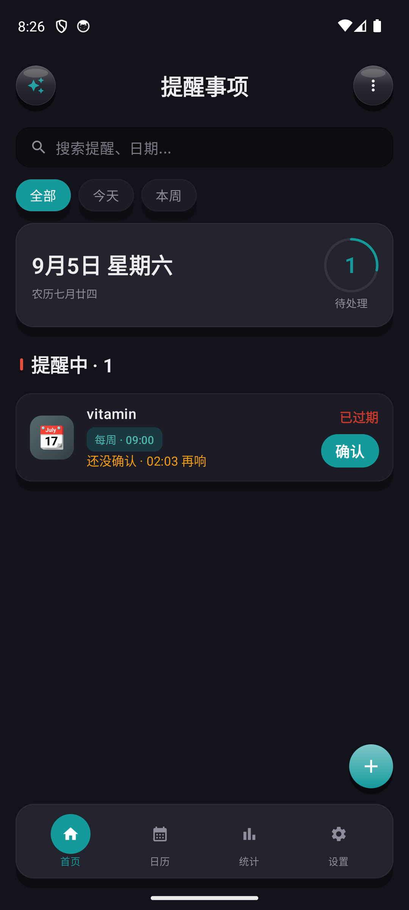
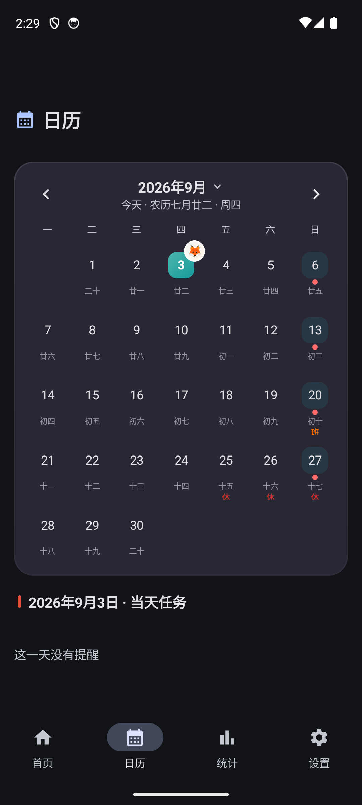
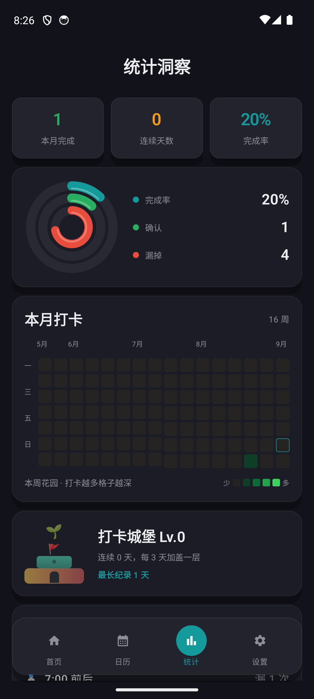

[🇨🇳 简体中文](README.md) · [🇺🇸 English](README.en.md) · [🇹🇼 繁體中文](README.zh-TW.md) · [🇯🇵 日本語](README.ja.md) · [🇰🇷 한국어](README.ko.md)

---

# 📱 리마인더 (Reminder App) — Android

기능이 풍부한 Android 네이티브 리마인더 앱으로, 반복 알림, 날짜 알림, 음력 생일, 공휴일 알림, 그리고 **AI 음성 비서**를 지원합니다.

[](https://developer.android.com)
[](https://kotlinlang.org/)
[](https://developer.android.com/about/versions/oreo)
[](LICENSE)







---

## 🌐 다국어 지원 / Multi-language Support

이 앱(Android 및 iOS 양쪽)은 시스템 언어 설정을 자동으로 따르는 다국어 지원을 내장하고 있습니다.

**지원 언어：**
- 🇨🇳 간체 중국어（zh-Hans）— 기본 언어 & 폴백
- 🇺🇸 English (en)
- 🇹🇼 번체 중국어 (zh-Hant)
- 🇯🇵 日本語 (ja)
- 🇰🇷 한국어 (ko)

**구현 방식 / Implementation：**
- **Android**：`res/values/strings.xml`(간체 중국어 기준) + `values-en` / `values-zh-rTW` / `values-ja` / `values-ko` 리소스 한정자. 실행 시 `zh()` / `zhf()`(`com.reminderapp.i18n`)를 통해 문자열을 조회하며, `Service` / `Receiver` 같은 Compose 외부 컨텍스트에서도 호출할 수 있습니다.
- **iOS**：`Localizable.xcstrings` 다국어 카탈로그. SwiftUI는 `String(localized:)`로 다국어 문자열을 가져옵니다.
- 양쪽 플랫폼은 "중국어 원문을 키로 사용"하는 방식을 공유하므로, 문자열 추가·수정 시 중국어 원문과 번역표만 관리하면 되어 중복命名的 비용을 줄입니다.

> 사용자에게 보이는 문자열(약 330개)은 모두 다국어화되어 있으며, 번역이 없으면 간체 중국어 원문으로 폴백합니다.
> All user-visible strings (~330) are localized; missing translations gracefully fall back to Simplified Chinese.

---

## ✨ 기능

### 1. 반복 알림
- "N 분 / 시간 / 일 / 주 / 월 / 년마다" 주기적인 알림 지원
- **앵커 방식 계산**: 최초 발동 시각을 기준으로 하여 날짜 어긋남(월말 정렬, 윤년 처리) 방지
- **단계적 재알림**(iOS와 통일): 기한에 미확인 시 → 1시간 → 4시간 → 12시간 → 24시간 → 24시간. 상한에 도달하면 `overdue`(미완료)로 표시하고 알림을 멈춘 뒤 사용자의 수동 처리를 기다립니다
- 일시 중지 / 재개 / 삭제 가능

### 2. 날짜 알림
- 일회성 날짜 알림: 특정 날짜를 설정하면 당일 정시에 알림
- **사전 알림**: N일 전부터 매일 9:00에 미리보기 알림 전송
- 음력 생일과 양력 생일 지원
- 중국 법정 공휴일 13개 내장

### 3. AI 음성 비서 🤖
- 자연어로 알림 생성: "매일 저녁 8시에 강아지 산책 알려줘"
- 3가지 모드 지원:

| 모드 | 설명 |
|------|------|
| **무료 API** | 가입하여 무료 키를 받은 뒤 설정에 입력(가입 안내 포함) |
| **사용자 지정 API** | 본인의 OpenAI 호환 API 사용 |

- 음성 입력(`SpeechRecognizer`)
- Function Calling으로 생성 / 조회 / 삭제 / 연기 자동 분석
- 5개의 내장 API 템플릿(OpenAI / DeepSeek / Qwen / Doubao / 일반)

---

## 🏗️ 기술 스택

| 분류 | 기술 |
|------|------|
| UI | Jetpack Compose + Material 3 |
| 데이터 영속성 | Room Database |
| 백그라운드 스케줄링 | WorkManager |
| 알림 | NotificationCompat + NotificationChannel |
| 네트워크 | OkHttp 4 + Gson |
| 음성 | Android SpeechRecognizer |
| 아키텍처 | MVVM + Repository |

---

## 📁 프로젝트 구조

```
app/src/main/java/com/reminderapp/
├── data/
│   ├── entity/          # Room 엔티티 (ReminderEntity, ReminderRecordEntity)
│   ├── dao/             # DAO 인터페이스
│   └── database/        # AppDatabase (마이그레이션 포함)
├── service/
│   ├── ReminderEngine.kt        # 핵심 리마인더 엔진 (주기 / 확인 / 단계적 재알림 / 누락 확인)
│   ├── ReminderWorker.kt        # WorkManager 백그라운드 작업
│   ├── ReminderScheduler.kt     # WorkManager 스케줄러
│   ├── NotificationManager.kt   # 알림 전송 및 채널 관리
│   ├── LunarCalendar.kt        # 음력 변환 (1900-2100)
│   ├── HolidayService.kt       # 공휴일 서비스
│   ├── AIService.kt            # AI API 호출 + Function Calling
│   ├── AITools.kt              # AI 도구 정의
│   ├── AISettings.kt           # AI 설정 저장
│   ├── VoiceService.kt         # 음성 인식
│   ├── BackupHelper.kt         # JSON 백업 가져오기 / 내보내기
│   ├── WebDavSync.kt           # Nutstore / 일반 WebDAV 양방향 동기화
│   ├── NearbyShareService.kt   # 동일 LAN TCP 전송 (47823)
│   └── QrCodeUtils.kt          # QR 코드 생성 및 스캔
├── ui/
│   ├── screen/                  # HomeScreen / CalendarScreen / StatsScreen / AIChatScreen / NearbyShareScreen / Settings / ...
│   ├── theme/                   # 디자인 토큰 (iOS 테마 색상과 일치)
│   └── viewmodel/               # HomeViewModel / ReminderDetailViewModel / ...
├── receiver/
│   ├── NotificationActionReceiver.kt  # 알림 "확인" / "나중에" 버튼 처리
│   └── BootReceiver.kt               # 부팅 시 WorkManager 작업 재등록
├── widget/                      # 홈 화면 위젯
├── MainActivity.kt
└── ReminderApp.kt
```

---

## 🚀 빌드 및 실행

### 사전 요구 사항

- [Android Studio](https://developer.android.com/studio) Hedgehog (2023.1.1) 이상
- Android SDK 34
- JDK 17

### 빌드 단계

```bash
# 1. 저장소 복제
git clone https://github.com/tsumon/reminder-app-android.git
cd reminder-app-android

# 2. Android Studio에서 프로젝트 열기
#    Gradle과 종속성이 자동으로 다운로드됩니다

# 3. APK 빌드
./gradlew assembleDebug          # Debug APK
./gradlew assembleRelease        # Release APK (서명 설정 필요)

# 4. 기기에 설치
./gradlew installDebug
```

### Release APK 생성

`app/build.gradle.kts`에서 서명을 설정합니다:

```kotlin
android {
    signingConfigs {
        create("release") {
            storeFile = file("keystore.jks")
            storePassword = "your_password"
            keyAlias = "your_alias"
            keyPassword = "your_password"
        }
    }
    buildTypes {
        release {
            signingConfig = signingConfigs.getByName("release")
        }
    }
}
```

그 후:

```bash
./gradlew assembleRelease
# APK 경로: app/build/outputs/apk/release/app-release.apk
```

---

## 📱 시스템 요구 사항

- Android 8.0 (API 26) 이상
- 알림 권한 (Android 13+에서는 수동 허용 필요)
- 마이크 권한 (AI 음성 기능)
- 네트워크 권한 (AI 기능)

---

## 🔄 변경 이력

| Version | Date | Changes |
|---------|------|---------|
| v2.7.1 | 2026-09 | soft-ui chrome: hammer 3D soft-shadow, dock fill to physical bottom (DockH 48 / selected 32), settings row 52 |
| v2.7.0 | 2026-09 | soft-ui paper elevation; today card + pending ring; stats donut + monthly heatmap |
| v2.6.0 | 2026-09 | In-row confirm, calendar day tasks, empty completion rate shows 0% |
| v2.4.14 | 2026-08 | AI asks one question at a time; solar+lunar birthday rows merged |
| v2.4.10 | 2026-08 | Skip weekends/holidays to next workday |
| v2.4.0 | 2026-08 | Home timeline + 6-color themes |
| v2.3.0 | 2026-08 | Brand color → teal |


Earlier: [https://github.com/tsumon/reminder-app-android/releases](https://github.com/tsumon/reminder-app-android/releases).
