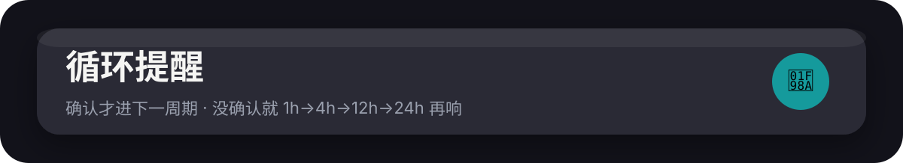
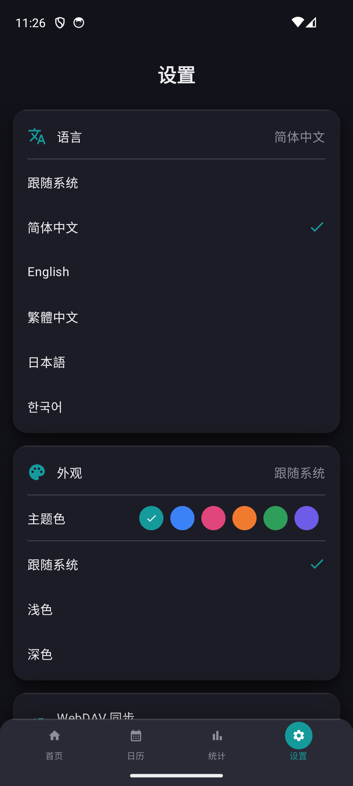
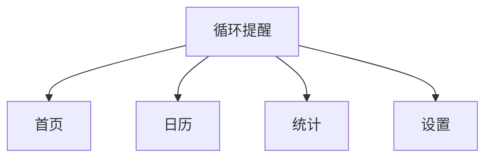
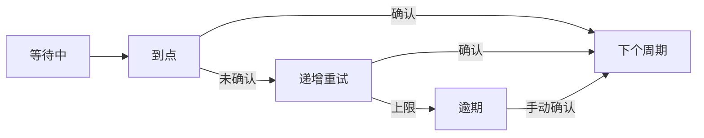

[🇨🇳 简体中文](README.md) · [🇺🇸 English](README.en.md) · [🇹🇼 繁體中文](README.zh-TW.md) · [🇯🇵 日本語](README.ja.md) · [🇰🇷 한국어](README.ko.md)

---

# 循环提醒

Android 原生。到期你点确认，周期才往前走；滑掉就按 1 小时 → 4 小时 → 12 小时 → 24 小时再催，直到 overdue。

<p align="center">
  
</p>

<p align="center">
  
</p>

[](https://developer.android.com)
[](https://kotlinlang.org/)
[](https://developer.android.com/about/versions/oreo)

| 首页 | 日历 | 统计 | 设置 |
|:---:|:---:|:---:|:---:|
|  |  |  |  |

## 当前界面（v2.7.1）

锤子纸面 soft-shadow：浅纸底 / 深抬升面 `#2A2A36`，卡无描边，动作是软圆钮。底栏 fill 铺满物理底（DockH 48，选中圆 32）。设置单行 52。四个 Tab。AI 在设置里配。Android FAB 44 正圆压在 dock 上方。

- **首页**：inset 搜索；芯片 全部 / 今天 / 本周；今日卡 + soft 环待处理；提醒中 / 等待中。到期行内确认。重试行写「还没确认 · HH:MM 再响」。
- **日历**：月卡；今天竖胶囊 + 🦊；公历 + 农历 + 班/休；点日期列当天任务。
- **统计**：三砖 + soft donut + 本月打卡热力 + 打卡城堡 + 最常忘记。
- **设置**：主题皮肤、同步、AI、更新。





## 功能

- 周期提醒（分钟/小时/天/周/月/年）+ 锚点防漂移
- 递增重试对齐 iOS：1h → 4h → 12h → 24h → overdue
- 日期提醒、农历生日、节假日；可避开周末/假日
- AI 语音助手（免费 API / 自定义 OpenAI 兼容）
- WebDAV、近场互传、GitHub Releases 升级
- Room + WorkManager，离线可用

<details>
<summary>多语言</summary>

简 / 繁 / 英 / 日 / 韩。`values` / `values-en` / `values-zh-rTW` / `values-ja` / `values-ko`。缺译文回退简体。

</details>

## 怎么跑

```bash
cd reminder-app-android
./gradlew :app:assembleDebug
# 或 Android Studio 打开工程 Run
```

Min SDK 26。Release 包见 [Releases](https://github.com/tsumon/reminder-app-android/releases)（含 `app-release-2.7.1.apk`）。

<details>
<summary>技术栈 / 结构</summary>

| 类别 | 技术 |
|------|------|
| UI | Jetpack Compose + Material 3 + SoftUI |
| 数据 | Room |
| 调度 | WorkManager |
| 网络 | OkHttp + Gson |

```
app/src/main/java/com/reminderapp/
├── data/          # Room entity / dao / repo
├── ui/screen/     # Home / Calendar / Stats / Settings
├── ui/theme/      # Tokens / SoftUI
└── worker/        # 通知与重试
```

</details>

## 版本历史

| 版本 | 日期 | 更新内容 |
|------|------|----------|
| v2.7.2 | 2026-09 | AI dock 修复；模型列表/测连通；模板；分享 ICS；小组件确认 |
| v2.7.1 | 2026-09 | soft-ui chrome：锤子立体软影、底栏铺物理底（DockH 48 / 选中圆 32）、设置行高 52 |
| v2.7.0 | 2026-09 | soft-ui 纸面软影；首页今日卡+待处理环；统计 donut + 本月打卡热力 |
| v2.6.0 | 2026-09 | 行内确认、日历当天任务、统计空完成率 0% |
| v2.4.14 | 2026-08 | AI 一次只问一事；公历+农历生日合并显示 |
| v2.4.10 | 2026-08 | 避开节假日/周末自动顺延到下一工作日 |
| v2.4.0 | 2026-08 | 首页时间线 + 六色主题 |
| v2.3.0 | 2026-08 | 品牌色改青碧 Teal |


更早版本见 [Releases](https://github.com/tsumon/reminder-app-android/releases)。签名 / keystore / applicationId 未改。

## License

MIT
