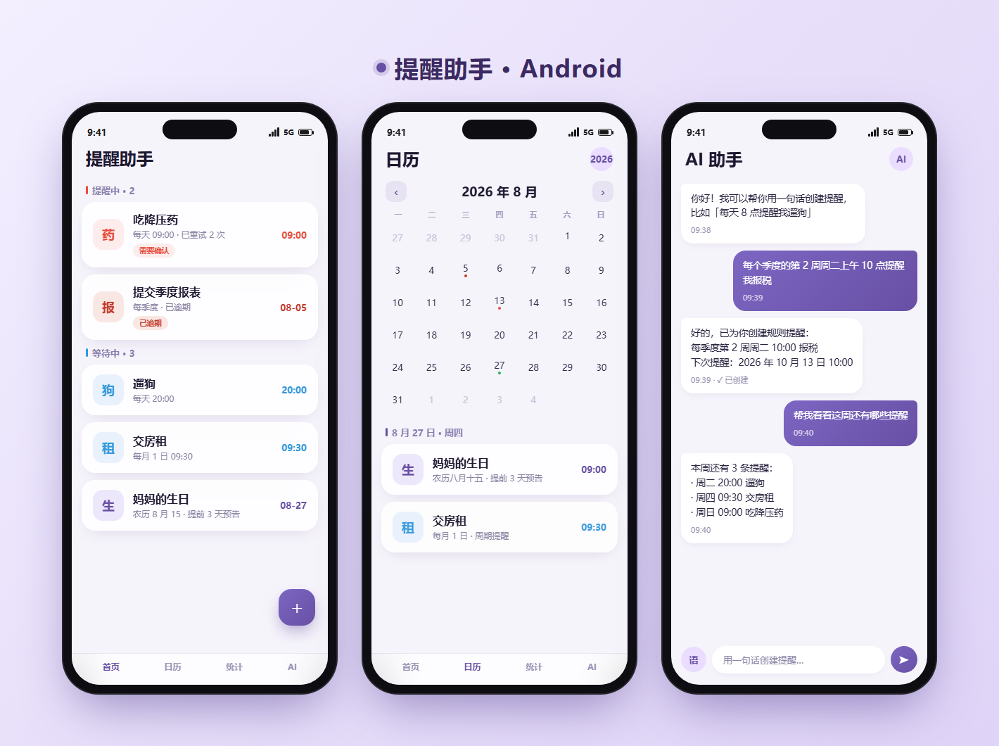

[🇨🇳 简体中文](README.md) · [🇺🇸 English](README.en.md) · [🇹🇼 繁體中文](README.zh-TW.md) · [🇯🇵 日本語](README.ja.md) · [🇰🇷 한국어](README.ko.md)

---

# 📱 提醒助手 (Reminder App) — Android

一套功能完整的 Android 原生提醒應用，支援循環提醒、日期提醒、農曆生日、節假日提醒，以及 **AI 語音助理**。

[](https://developer.android.com)
[](https://kotlinlang.org/)
[](https://developer.android.com/about/versions/oreo)
[](LICENSE)



---

## 🌐 多語言支援 / Multi-language Support

本應用（Android 與 iOS 雙端）內建多語言支援，跟隨系統語言自動切換。

**支援語言：**
- 🇨🇳 簡體中文（zh-Hans）— 預設語言 / 回退語言 (default & fallback)
- 🇺🇸 English (en)
- 🇹🇼 繁體中文 (zh-Hant)
- 🇯🇵 日本語 (ja)
- 🇰🇷 한국어 (ko)

**實作方式 / Implementation：**
- **Android**：`res/values/strings.xml`（簡體中文基準）+ `values-en` / `values-zh-rTW` / `values-ja` / `values-ko` 資源限定符；執行時代碼統一透過 `zh()` / `zhf()`（`com.reminderapp.i18n`）查表，Service / Receiver 等非 Compose 場景亦可呼叫。
- **iOS**：`Localizable.xcstrings` 多語言目錄，SwiftUI 透過 `String(localized:)` 取得多語言文案。
- 雙端共用「中文原串即 key」方案，新增 / 修改文案只需維護中文源串與譯文表，降低重複命名成本。

> 多語言文案已涵蓋全部使用者可見介面（約 330 條），翻譯缺失時自動回退為簡體中文原串。
> All user-visible strings (~330) are localized; missing translations gracefully fall back to Simplified Chinese.

---

## ✨ 功能

### 1. 循環提醒
- 支援「每隔 N 分鐘 / 小時 / 天 / 週 / 月 / 年」的週期提醒
- **錨點法計算**：基於首次觸發時間，避免日期漂移（月末對齊、閏年正確）
- **遞增重試**（對齊 iOS）：到點未確認 → 1h → 4h → 12h → 24h → 24h，達到上限標 `overdue` 停止轟炸，等使用者手動處理
- 可暫停 / 恢復 / 刪除

### 2. 日期提醒
- 一次性日期提醒：設定具體日期，當天準時通知
- **提前預告**：提前 N 天每日 9:00 推送預告通知
- 支援農曆生日、陽曆生日
- 內建 13 個中國法定節假日

### 3. AI 語音助理 🤖
- 自然語言建立提醒：「每天晚上 8 點提醒我遛狗」
- 支援 3 種模式：

| 模式 | 說明 |
|------|------|
| **免費 API** | 註冊取得免費 Key，填入設定即可（含註冊指引） |
| **自訂 API** | 使用自己的 OpenAI 相容 API |

- 語音輸入 (`SpeechRecognizer`)
- Function Calling 自動解析建立 / 查詢 / 刪除 / 延後提醒
- 內建 5 個 API 模板（OpenAI / DeepSeek / 千問 / 豆包 / 通用）

---

## 🏗️ 技術堆疊

| 類別 | 技術 |
|------|------|
| UI | Jetpack Compose + Material 3 |
| 資料持久化 | Room Database |
| 背景排程 | WorkManager |
| 通知 | NotificationCompat + NotificationChannel |
| 網路 | OkHttp 4 + Gson |
| 語音 | Android SpeechRecognizer |
| 架構 | MVVM + Repository |

---

## 📁 專案結構

```
app/src/main/java/com/reminderapp/
├── data/
│   ├── entity/          # Room 實體 (ReminderEntity, ReminderRecordEntity)
│   ├── dao/             # DAO 介面
│   └── database/        # AppDatabase (含遷移)
├── service/
│   ├── ReminderEngine.kt        # 核心提醒引擎（週期 / 確認 / 遞增重試 / 遺漏檢查）
│   ├── ReminderWorker.kt        # WorkManager 背景任務
│   ├── ReminderScheduler.kt     # WorkManager 排程器
│   ├── NotificationManager.kt   # 通知發送與頻道管理
│   ├── LunarCalendar.kt        # 農曆轉換 (1900-2100)
│   ├── HolidayService.kt       # 節假日服務
│   ├── AIService.kt            # AI API 呼叫 + Function Calling
│   ├── AITools.kt              # AI 工具定義
│   ├── AISettings.kt           # AI 設定儲存
│   ├── VoiceService.kt         # 語音辨識
│   ├── BackupHelper.kt         # JSON 備份匯入匯出
│   ├── WebDavSync.kt           # 堅果雲 / 通用 WebDAV 雙向同步
│   ├── NearbyShareService.kt   # 區域網路 TCP 互傳（47823）
│   └── QrCodeUtils.kt          # QR Code 生成與掃碼
├── ui/
│   ├── screen/                  # HomeScreen / CalendarScreen / StatsScreen / AIChatScreen / NearbyShareScreen / Settings / ...
│   ├── theme/                   # 設計令牌（與 iOS 主題色一致）
│   └── viewmodel/               # HomeViewModel / ReminderDetailViewModel / ...
├── receiver/
│   ├── NotificationActionReceiver.kt  # 通知確認 / 稍後按鈕處理
│   └── BootReceiver.kt               # 開機重註冊 WorkManager 任務
├── widget/                      # 桌面小工具
├── MainActivity.kt
└── ReminderApp.kt
```

---

## 🚀 建構與執行

### 前置需求

- [Android Studio](https://developer.android.com/studio) Hedgehog (2023.1.1) 或更新版本
- Android SDK 34
- JDK 17

### 建構步驟

```bash
# 1. 複製儲存庫
git clone https://github.com/tsumon/reminder-app-android.git
cd reminder-app-android

# 2. 用 Android Studio 開啟專案
#    會自動下載 Gradle 與依賴

# 3. 建構 APK
./gradlew assembleDebug          # Debug APK
./gradlew assembleRelease        # Release APK（需要簽署設定）

# 4. 安裝到裝置
./gradlew installDebug
```

### 產生 Release APK

在 `app/build.gradle.kts` 中設定簽署：

```kotlin
android {
    signingConfigs {
        create("release") {
            storeFile = file("keystore.jks")
            storePassword = "your_password"
            keyAlias = "your_alias"
            keyPassword = "your_password"
        }
    }
    buildTypes {
        release {
            signingConfig = signingConfigs.getByName("release")
        }
    }
}
```

接著：

```bash
./gradlew assembleRelease
# APK 路徑: app/build/outputs/apk/release/app-release.apk
```

---

## 📱 系統需求

- Android 8.0 (API 26) 及以上
- 通知權限 (Android 13+ 需要手動授權)
- 麥克風權限 (AI 語音功能)
- 網路權限 (AI 功能)

---

## 🔄 版本歷史

| 版本 | 日期 | 更新內容 |
|------|------|----------|
| v1.9.7 | 2026-08 | Android 遞增重試對齊 iOS（1h→4h→12h→24h→24h→overdue），UI 狀態 overdue 高亮 |
| v1.9.6 | 2026-08 | 五輪審查 70 項修復 + 近場傳輸 + 刪除 AI 免 API 模式 |
| v1.9.5 | 2026-08 | 檢查更新改 `releases.atom` 防 API 限流 |
| v1.9.4 | 2026-08 | WebDAV 同步 404 → 自動 MKCOL 建目錄 |
| v1.9.3 | 2026-08 | 設定頁（版本號 / 檢查更新 / 更新日誌） |
| v1.9.2 | 2026-08 | 更新檢查逾時重試 + WebDAV 友好提示 |
| v1.9.1 | 2026-08 | AI 規則提醒 + 首頁選單「檢查更新」 |
| v1.9.0 | 2026-08 | UI 優化（液態玻璃）+ 線上升級 + App 圖示 |
| v1.8.7 | 2026-08 | 小工具增強 / 節假日聯網 / 統計洞察 / .ics 匯出 / 設計令牌 / 崩潰監控 |
| v1.3.0 | 2026-08 | AI 語音助理 + Function Calling |
| v1.2.0 | 2026-08 | 日期提醒、農曆生日、節假日 |
| v1.0.0 | 2026-08 | 初始版：循環提醒 + 遞增轟炸 |

---

## 📄 授權

MIT
